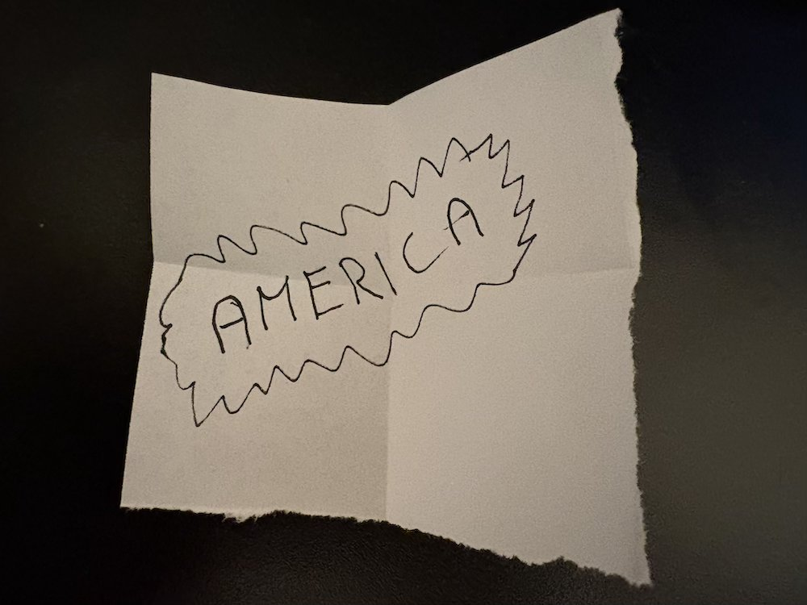

Rozhodli jsme se, že se chceme odstěhovat z Brna. Chtěli jsme vidět a zažít nové věci a já jsem chtěl získat další zkušenosti v práci. Lákalo nás taky zkusit život v zemi, kde ani jeden z nás není doma. V tom by naše situace byla vyrovnanější: oba bychom začínali od začátku.

Manželka, původem z Japonska, si uměla v uzenářství koupit patnáct deka šunky, ale na popovídání v češtině to ještě nebylo. Přemýšleli jsme tedy, kam zkusit jít dál.

Vzal jsem si v práci týden volna a vyrazili jsme do Londýna. Manželka se tam potkala se svou sestrou a zašly na koncert své oblíbené kapely, zatímco já jsem chodil na pohovory.

První firma se zabývala leasingem letadel nebo nějakého leteckého vybavení. Recruiter mě přesvědčoval, že první, technické kolo pro mě nebude problém a že se mám soustředit na druhé, ve kterém půjde hlavně o to, jestli zapadnu do firmy. Takže jsem se přes noc stal odborníkem na leasing a letecké tryskové motory. Taky mi doporučil oblek a nejlepší boty, co mám.

Firma sídlila v centru Londýna. Před silným deštěm jsem se tak tak stihl schovat ve foyer její prosklené budovy. Všichni tam pobíhali v kostýmcích a oblecích. V technickém kole se mě ptali na spoustu věcí, ale už si pamatuju jen otázku, jak bych naprogramoval databázové migrace. Noc předtím jsem se v hostelu špatně vyspal a příliš jsem nezazářil. Myslím, že na druhé kolo ještě někoho poslali, ale bavil se se mnou sotva deset minut. Chvíli po odchodu z kanceláře mi volal recruiter, že jsem neprošel už prvním kolem.

Druhý pohovor byl ve firmě na předměstí Londýna, prý v takovém britském Amazonu. Šel mnohem lépe. Zaujaly mě technologie i lidé, se kterými jsem se potkal. Paní z personálního mi nabídla taxík zpátky na vlak do Londýna, ale odmítl jsem. Chtěl jsem si Hartfield projít.

Popravdě nic moc. Představoval jsem si, jak každý den jedu z Londýna vlakem a potom mikrobusem do firmy. A večer zase zpátky. Nebo bych měl bydlet v Hartfieldu? Nevím, asi by tam byla večer nuda.

Následovaly další pohovory. Do Tesca jsem přišel pozdě a potkal se až přímo s manažerem v kravatě. Působil na mě trochu odtrženě od technické práce a mírně komisně. Další recruiter mě pořád přemlouval k pohovoru v Leicesteru a vychvaloval výhody menšího města oproti Londýnu. Vymluvil jsem se na nedostatek času.

Nakonec jsem dostal dvě pracovní nabídky. Když jsem ale započítal mnohem vyšší životní náklady v Londýně oproti Česku, finančně to nevycházelo příliš dobře.

O několik týdnů později jsme vyrazili do Dublinu, dalšího města, kde jsme si dokázali představit život. Tentokrát bez pohovorů. Nejdřív jsme chtěli zjistit, jestli by nám město sedělo.

Stereotyp o Irsku se potvrdil: tráva byla všude krásně zelená. Pamatuju si sochu zdviženého palce Facebooku a cyklistu manévrujícího mezi dvěma dvoupatrovými autobusy. A taky fish and chips s velkou lahví octa na stole. Porce byla tak obrovská, že jsme ji nedojedli ani později, když jsme si zbytek nechali zabalit s sebou.

Dublin na nás celkově udělal lepší dojem než Londýn. Město bylo hezké, ale platy se zdály být podobné jako v Londýně, ne-li nižší. Praha byla blíž rodnému Brnu a připadala nám jako jednodušší možnost. Dublin jsme ale ještě úplně neodepsali.

Při odletu jsem z okénka koukal na Irsko a přemýšlel, jestli tuhle zemi vidím naposledy, nebo s ní spojím velkou část, ne-li zbytek svého života. Ještě jsem nevěděl.

Nakonec jsem se rozhodl zkusit štěstí ještě v Praze. Po Londýně nám připadala jako docela dobrá varianta: dostupnější bydlení, výrazně vyšší platy než v Brně, pár kamarádů a snazší návštěvy rodiny. Taky jsme doufali, že by se tam manželka mohla lépe uchytit, jazykově i celkově.

S tréninkem z Londýna jsem si naplánoval deset pohovorů během čtyř dnů. Někde mě odradil manažer, jinde technologie nebo samotná práce. Do jedné firmy jsem dorazil pozdě, udýchaný a zpocený. Chtěl jsem si střihnout zkratku přes hřbitov, jenže nebyl průchozí a musel jsem se vrátit.

Na poslední pohovor jsem už skoro nechtěl jít. Nakonec jsem šel jen proto, že se mi nechtělo tak dlouho čekat na vlak. Bylo to nějaké elektronické knižní vydavatelství či co, s ústředím v Kalifornii. Zřejmě jsem na ně udělal dobrý dojem: přijali moje platové požadavky a nabídli mi výrazně víc než ostatní. Tak jsme si plácli. Byl rok 2018 a uchazeči o práci si mohli klást skoro nerealistické podmínky.

V Brně jsem na personálním podal výpověď. Manažera to zaskočilo a začal vymýšlet, jak situaci zachránit.

„Hele, v Coloradu Charles staví nový tým zaměřený na přechod na cloud a nabírají. Nechtěl bys to zkusit?“

Pohovor měl dvě kola a byl neformální. První jsem absolvoval ze svatby manželčiny kamarádky v Praze. Volal jsem z předsálí hotelu pod obrovskou olejomalbou v rembrandtovských tónech. Pak jsem se vrátil na oslavu, kde se hrál vědomostní kvíz o japonské a české kultuře.

Ve druhém kole jsme se bavili o dobrých restauracích v Boulderu a o tom, jak krásné jsou na podzim Skalnaté hory a Front Range v Coloradu.

Za dva týdny jsem dostal konkrétní nabídku. Přesné důvody, proč nás Amerika tak lákala, už si moc nepamatuju. Bylo to spíš intuitivní. Chtěli jsme poznat zemi, kterou jsme z filmů a dalších vyprávění znali možná až moc dobře, ale z vlastní zkušenosti vůbec. Zažít třeba i takovou obyčejnou věc, jako je noc v levném motelu u silnice z amerických filmů.

**Co mi z toho zůstalo**

- Při výběru práce si představit i obyčejný den kolem ní. Dojíždění, večery a život nás obou.
- Dát šanci i situacím, od kterých moc nečekám. Třeba tomu poslednímu pohovoru před odjezdem vlaku.
- Všímat si, co mi život přinese, a být připravený změnit plán.

---

Svolali jsme s manželkou rodinnou radu o dvou členech. Chvíli jsme se o tom bavili a pak každý napsal na papírek, jestli chce zůstat v Česku, nebo zkusit štěstí ve Státech. Složené papírky jsme dali do klobouku, navečeřeli se a rozbalili je.

Na jednom stálo „Boulder“ a na druhém „America“.

